# RBF SVM (Radial Basis Function)  

To find the model with the highest accuracy, I try to set log2C in range of -1 to 3, and log2gamma in range of -4 to 1, and obtain C = 2 and gamma = 0.0625.

## Accuracy (%) For Each Digit  

| Digit 0 | Digit 1 | Digit 2 | Digit 3 | Digit 4 | Digit 5 | Digit 6 | Digit 7 | Digit 8 | Digit 9 |
| :-----: | :-----: | :-----: | :-----: | :-----: | :-----: | :-----: | :-----: | :-----: | :-----: |
|  99.53  |  99.76  |  98.88  |  98.85  |  99.15  |  98.74  |  99.3   |  99.06  |  98.36  |  98.83  |

## Number Of Support Vectors For Each Digit  

| Digit 0 | Digit 1 | Digit 2 | Digit 3 | Digit 4 | Digit 5 | Digit 6 | Digit 7 | Digit 8 | Digit 9 |
| :-----: | :-----: | :-----: | :-----: | :-----: | :-----: | :-----: | :-----: | :-----: | :-----: |
|  5860   |  2419   |  6882   |  7123   |  6303   |  6682   |  5648   |  5734   |  7666   |  6488   |

## The 3 Examples Of Largest Lagrange Multiplier On Both Sides Of The Discriminant Plane For Each Digit

|        |         Digit 0          |         Digit 1          |         Digit 2          |         Digit 3          |         Digit 4          |         Digit 5          |         Digit 6          |         Digit 7          |         Digit 8          |         Digit 9          |
| :----: | :----------------------: | :----------------------: | :----------------------: | :----------------------: | :----------------------: | :----------------------: | :----------------------: | :----------------------: | :----------------------: | :----------------------: |
| y = 1  | 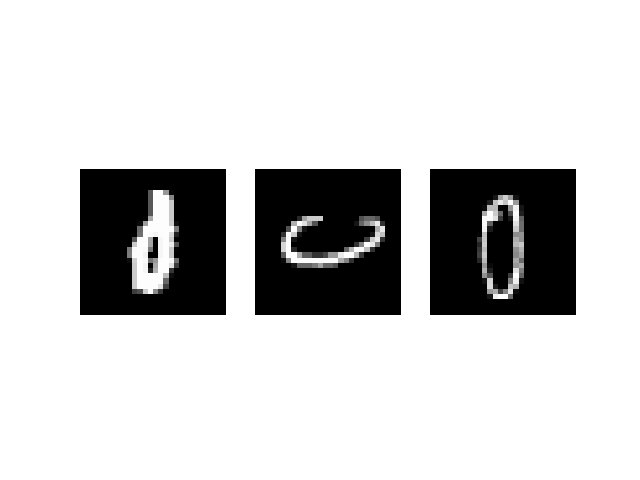 | 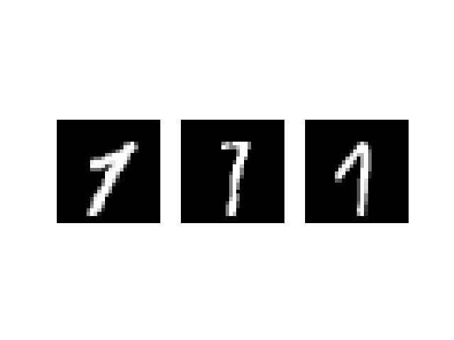 | 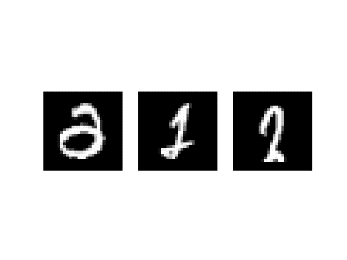 | 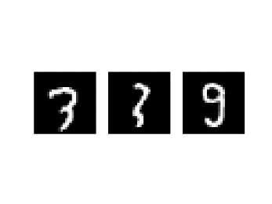 | 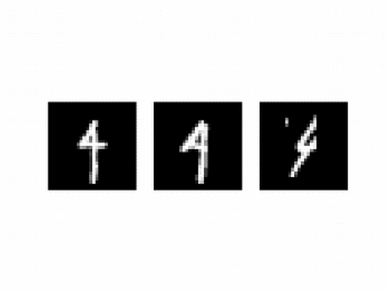 | 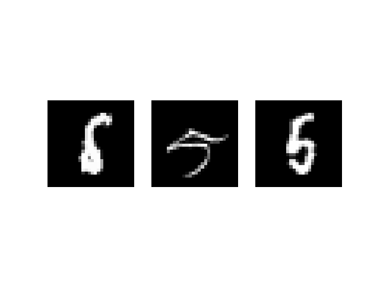 | 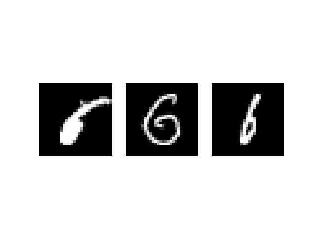 | 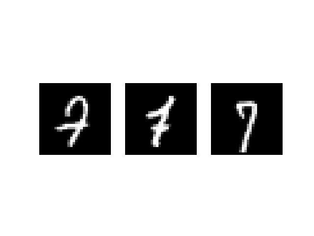 | 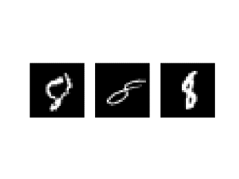 | 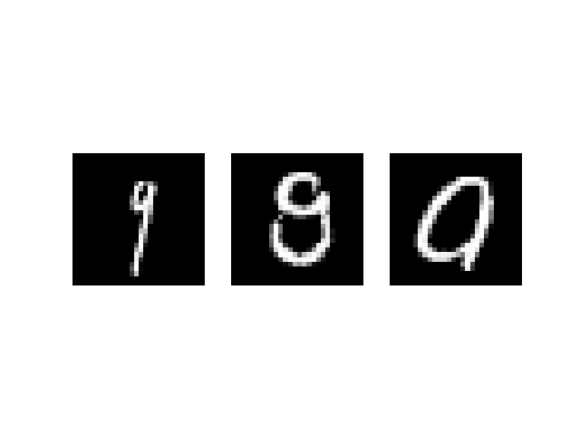 |
| y = -1 | 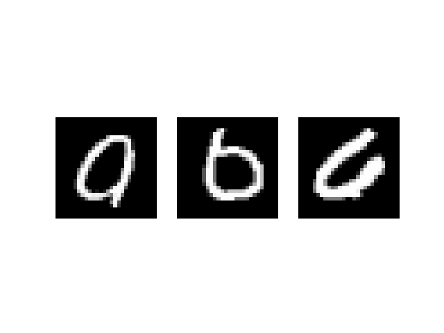 | 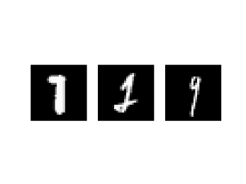 | 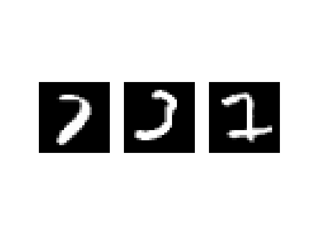 | 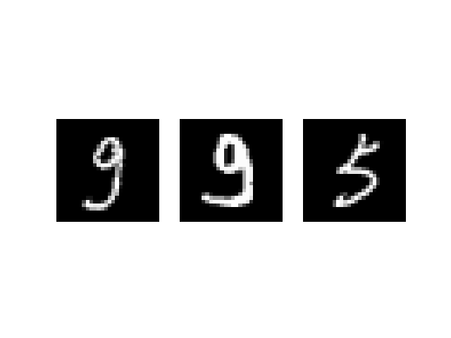 | 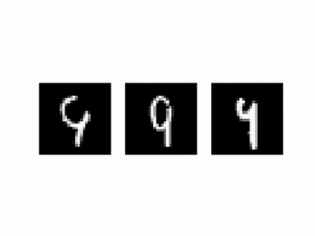 | 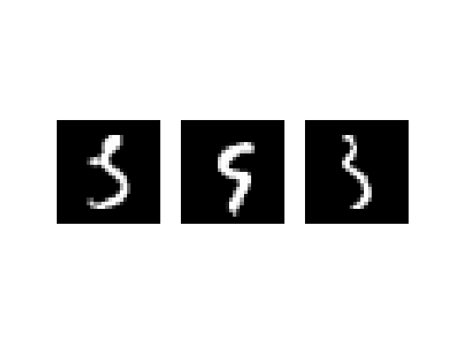 | 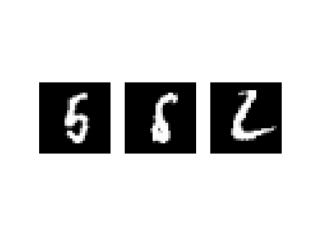 | 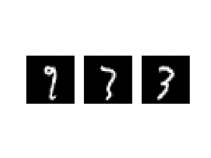 | 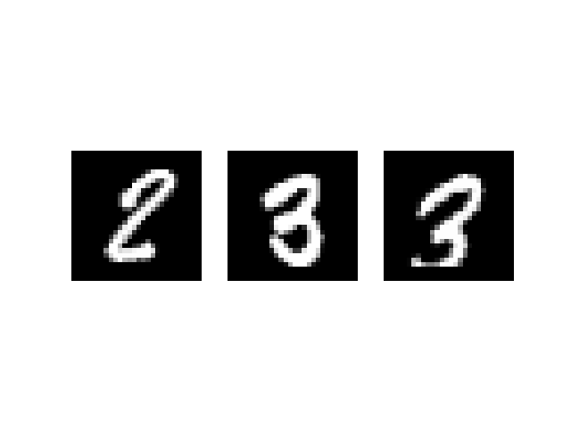 | 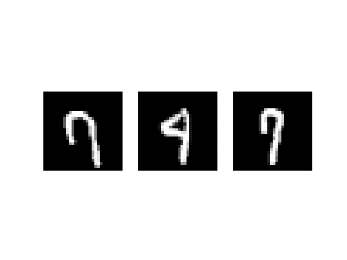 |

## CDF Of The Margin For Each Digit

|         |                         |
| :-----: | :---------------------: |
| Digit 0 | 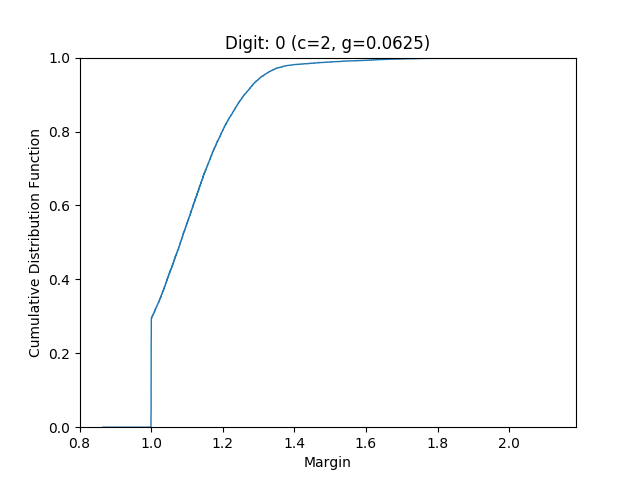 |
| Digit 1 |  |
| Digit 2 | 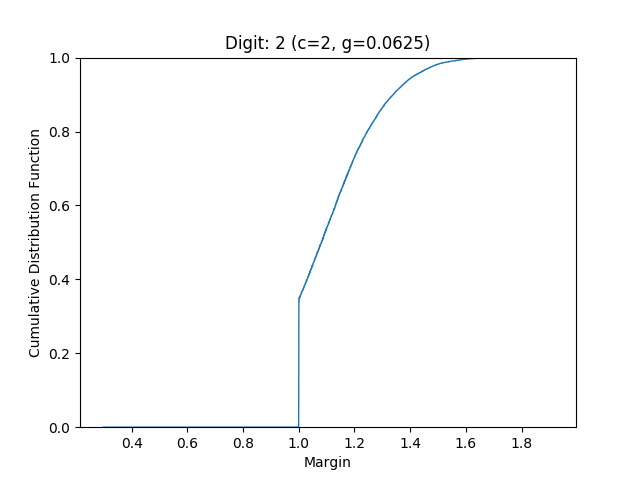 |
| Digit 3 | 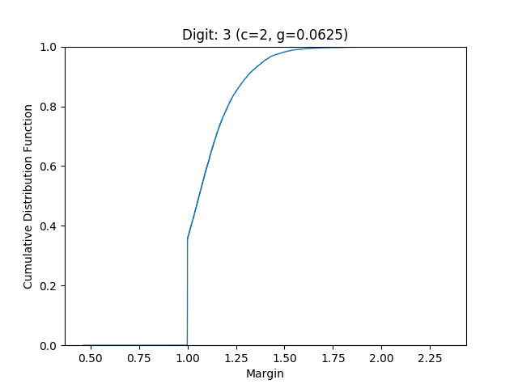 |
| Digit 4 | 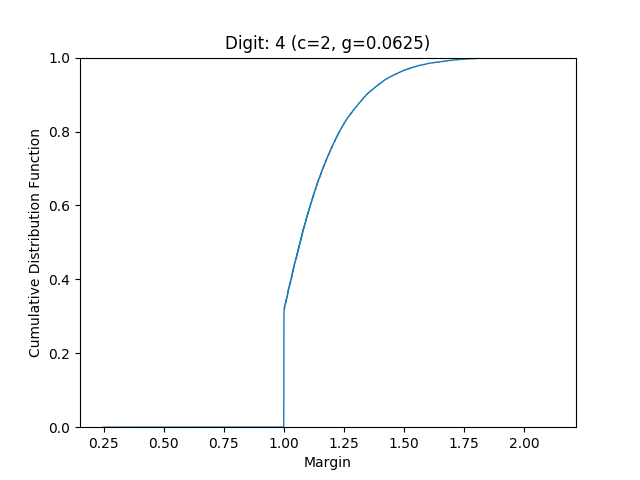 |
| Digit 5 | 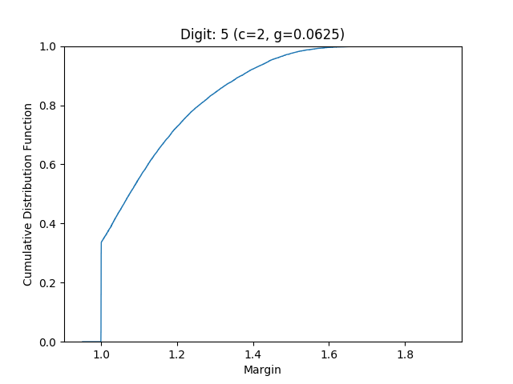 |
| Digit 6 | 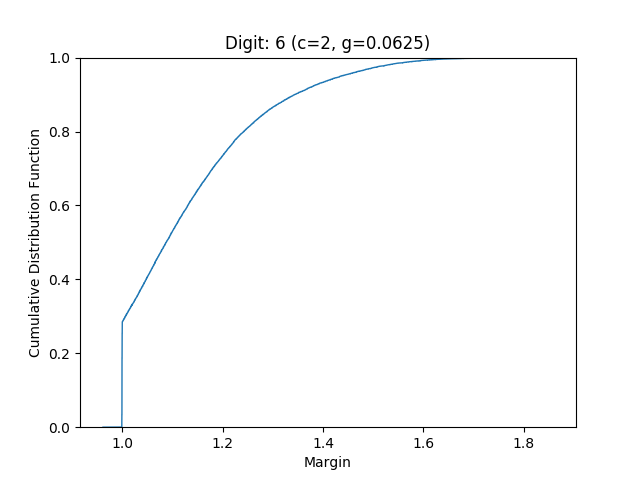 |
| Digit 7 | 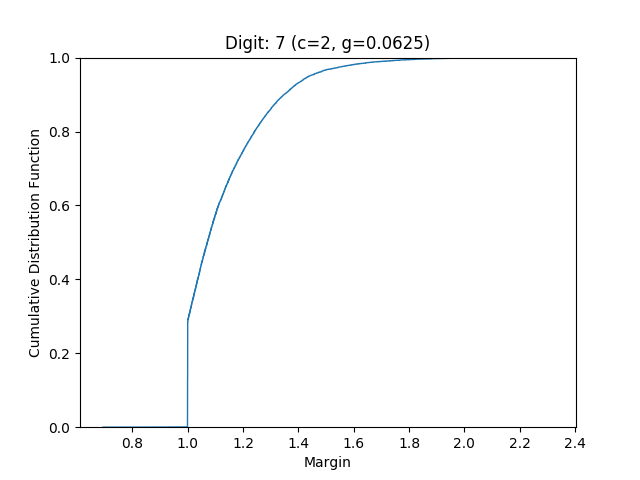 |
| Digit 8 | 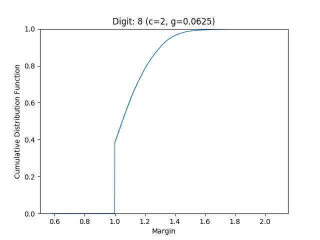 |
| Digit 9 | 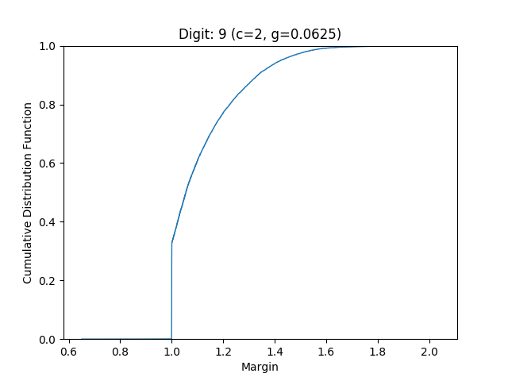 |
